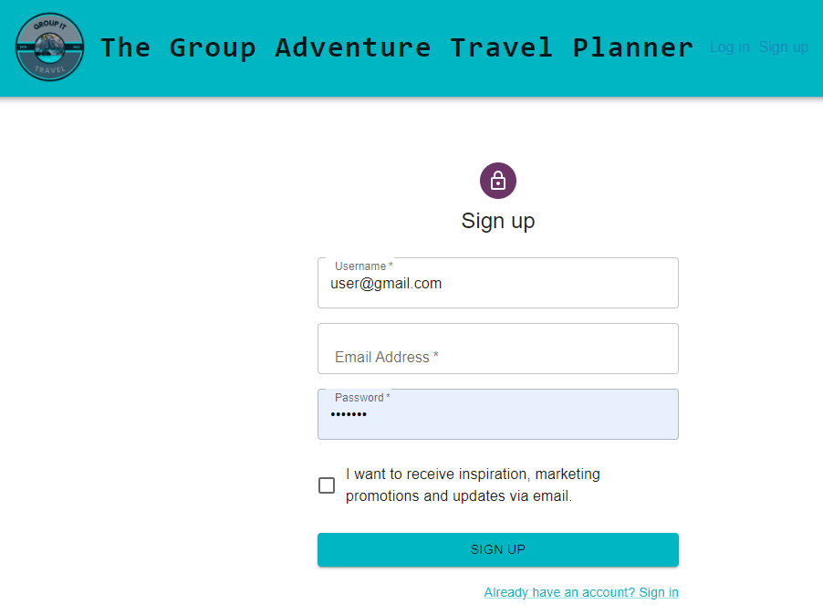
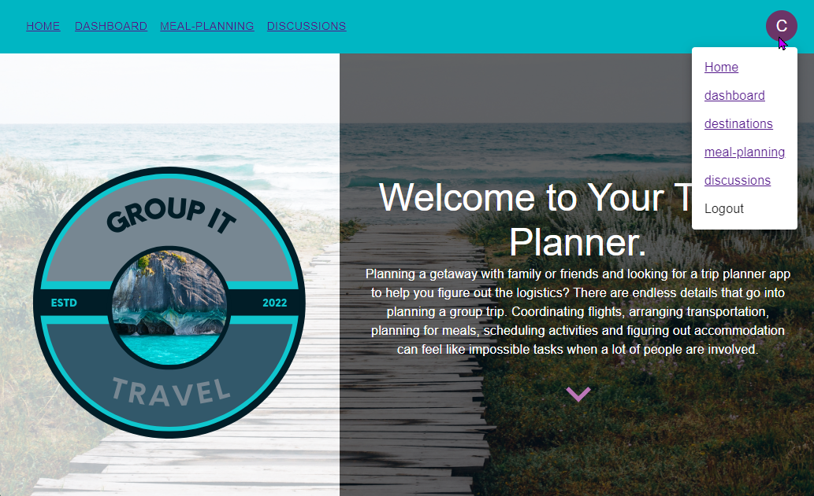

# Group It - The Group Adventure Travel Planner
Planning a getaway with family or friends and looking for a trip planner app to help you figure out the logistics? 
There are endless details that go into planning a group trip. Coordinating flights, arranging transportation, planning for meals, scheduling activities and figuring out accommodation can feel like impossible tasks when a lot of people are involved.

## Table Of Contents

- [Description](#description)
- [Usage](#usage)
- [Technologies used](#technologies-used)
- [Application](#application-deployed-url)
- [License](#license)

## Description

The Group It - Group Adventure Travel Planner makes group travel easy! An intuitively designed app that allows group travel planners to seamlessly coordinate, plan, and book group trips all in one place. From voting on the destination, to sharing flight bookings!
Bachelor parties, girls trips, family reunions, couples’ getaways… you-name-it. It doesn’t matter whether you’re flying, driving, or walking to your destination. The Group It planner is designed to help with the logistics, no matter how big or small.

## Usage

## Technologies Used

- api
- apollo
- CSS
- date-fns
- emotion
- express.js
- graphql
- javaScript
- jwt
- material ui
- mongodb
- mongooseodm
- node.js
- react.js
- roadgoat

## Application Deployed Url

Below is link for application deployed using Heroku

[Group It - The Group Adventure Travel Planner](https://group-it-travel-planner.herokuapp.com/)

Scan the QR code to view the live web site

## License

No license.